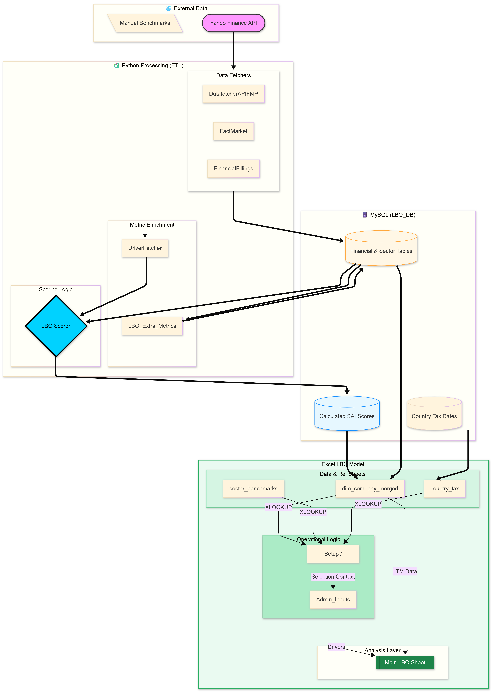

# SAI score
## Automated LBO drafting of 160 european companies

This project is an end-to-end pipeline designed to **identify and evaluate potential Leveraged Buyout (LBO) opportunities among European companies**.

At the core of the system is the **SAI Note (Score of Attractivity of Investment)** — a scoring framework designed to rapidly estimate whether a company could represent a viable LBO target.

The system combines:

- **Python-based financial data collection**
- **SQL structured storage**
- **quantitative scoring of LBO attractiveness**
- **Excel LBO modelling connected via Power Query**

The objective is to **reduce the time required to identify promising investment targets** while still allowing analysts to run a simplified deal simulation.

The workflow reflects a simplified version of the analytical pipeline used in **private equity deal sourcing and screening**.

---

# Score of Attractivity of Investment

Private equity firms review **thousands of potential companies** but only pursue a very small number of transactions.  

The most scarce resource in deal sourcing is **analyst time**.

The **SAI Note** was designed as a simple screening metric that helps answer a first question:

> *Is this company worth spending time modelling in detail?*

Rather than building a full LBO model for every company, the SAI score provides a **quick first-pass attractiveness indicator**.

It combines several dimensions that are typically important in LBO transactions:

- stability of cash flows
- debt capacity
- margin improvement potential
- balance sheet strength
- sector benchmarks

The score **does not replace detailed financial analysis**.  
Instead it acts as a **filter**, allowing analysts to focus attention on companies that already show favourable structural characteristics.

In practice this type of scoring system helps to:

- **prioritize targets faster**
- **reduce time spent on weak candidates**
- **standardize the initial screening logic**
- **improve comparability across companies**

Once companies are ranked using the SAI score, analysts can move to the next step: **simulating the economics of a potential acquisition.**

---

# Pipeline Overview

The project is structured as a pipeline moving from raw financial data to a user-driven LBO simulation.

1. **Python scraping & data collection**
2. **Data storage in SQL database**
3. **Company scoring (SAI Note)**
4. **Excel import through Power Query**
5. **User-driven LBO simulation**

Below is the high-level architecture of the pipeline.

*(replace the file name with your pipeline PNG once uploaded to the repo)*

---

# Project Goal

The project evaluates **European listed companies** and estimates their **potential attractiveness for a leveraged buyout**.

The process occurs in two stages.

### Stage 1 — Screening

Companies are ranked using the **SAI Note**, which evaluates structural LBO suitability.

### Stage 2 — Simulation

Once a company is selected, the user can run a simplified **LBO simulation** using adjustable assumptions such as:

- leverage
- revenue growth
- EBITDA improvement
- holding period
- entry and exit multiples

The model then estimates the **investment performance for the sponsor**.

---

# Key LBO Metrics Produced

The simulation generates common private-equity deal metrics:

- **IRR / TRI**
- **MOIC**
- **EBITDA at Exit**
- **Exit Multiple**
- **Enterprise Value**
- **Net Debt**
- **Sponsor Equity Value**
- **Sponsor Equity at Entry**

These outputs allow a quick view of whether the investment could meet typical **private equity return targets**.

---

# System Architecture

## 1. Python Data Layer

Python scripts collect and prepare financial information.

Main responsibilities:

- fetch company financial statements
- collect market data
- compute derived financial metrics
- enrich datasets with indicators relevant to LBO screening

Libraries used:

pandas
numpy
sqlalchemy
pymysql
yfinance

---

## 2. SQL Database

All raw and enriched data is stored in a relational database.

Main tables:

| Table | Purpose |
|-----|-----|
| `dim_company` | company master data |
| `fact_financials` | historical financial statements |
| `ref_sector_benchmarks` | sector benchmark indicators |
| `Calculated_Scores` | SAI Note results |
| `Fact_Market_Data` | market price data |
| `LBO_Extra_Metrics` | additional derived metrics |

This structure separates **raw financial data**, **derived metrics**, and **scoring outputs**.

---

## 3. SAI Scoring Methodology

The **SAI Note** aggregates several dimensions relevant for LBO transactions.

The score is structured around three pillars:

| Pillar | Description | Weight |
|------|------|------|
| Serviceability | ability to support leverage through stable cash flows | 40% |
| Value Creation | margin improvement and operational upside | 30% |
| Collateral | balance sheet strength and asset coverage | 30% |

The resulting score helps rank companies by **structural suitability for leveraged acquisitions**.

---

# Excel LBO Model

The Excel model provides the **interactive deal simulation layer**.

Using **Power Query**, the model imports data from the SQL database and distributes it across structured sheets.

### Data Sheets

| Sheet | Description |
|-----|-----|
| `dim_company` | company data merged with scores and financial facts |
| `country_tax` | corporate tax rates |
| `sector_benchmarks` | sector operating benchmarks |

---

# LBO Input Structure

The `Admin_Inputs` + `Setup` sheet organize the model assumptions.

# Data Flow Summary

Python Data Collection
↓
SQL Database
↓
SAI Screening Score
↓
Power Query Extraction
↓
Excel LBO Model
↓
Deal Performance Metrics

---

# Future Improvements

The project is still evolving.

Possible upgrades include:

- more detailed **debt tranches**
- **cash sweep mechanics**
- improved **working capital modelling**
- improved **sector benchmark calibration**

---

### Power BI LBO Engine

A future extension is a **Power BI dashboard capable of running LBO simulations directly**, bypassing Excel.

Potential benefits:

- real-time scenario analysis
- interactive dashboards
- customizable deal parameters

This would move the project closer to a **lightweight internal screening tool for investment teams**.

---

# Author

Built as an independent project exploring **LBO analytics, financial modelling, and financial data pipelines**.